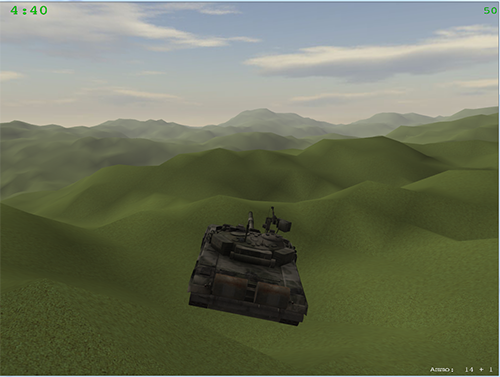

Little Tank That Could
======================

Little Tank That Could is a game I made for my Computer Graphics and Game Technology class.

Little Tank That Could is an arcade game in which the player controls a tank. The player must find and destroy all enemies before the timer runs out.

[Gameplay video](http://www.youtube.com/watch?v=b9BjdQYTVa8)    
[Download](https://bitbucket.org/zero-slo/little-tank-that-could/downloads/Little%20Tank%20That%20Could%20v1.0.1%20Redist.zip)   

[Little Tank That Could 2: Try Harder](https://bitbucket.org/zero-slo/little-tank-that-could-2-try-harder), a Unity version of the game     
[Other games from the CG 2013/14 class](https://www.youtube.com/watch?v=NTk769wBu9Q)       

Libraries used:   
+ [LWJGL](http://lwjgl.org/)      
+ [JBullet](http://jbullet.advel.cz/)     

***
Jani Bevk   
Computer Graphics and Game Technology class 2013/14   
Faculty of Computer and Information Science   
University of Ljubljana